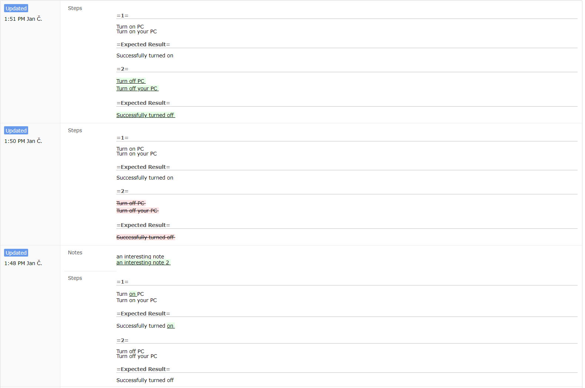

# TestRail Historian
This add-on injects JavaScript into TestRail web pages for better history view. 

Compatible with TestRail *5.4.1.3669* and lower.

Before add-on: 

After add-on:

## Release Notes
* bumped version

## Add-on for FireFox
[TestRail Historian v1.0](https://addons.mozilla.org/cs/firefox/addon/testrail-historian/)

## Add-on for Chrome
* download file [TestRail Historian v1.0](https://github.com/cernyjan/TestRail-Historian/blob/master/testrail_historian-1.0-an+fx.xpi)
* extract it on the file system
* open Extensions page in browser
* click the “Developer mode” checkbox to activate it
* click the “Load unpacked extension” button
* Navigate to the extension’s directory and open it